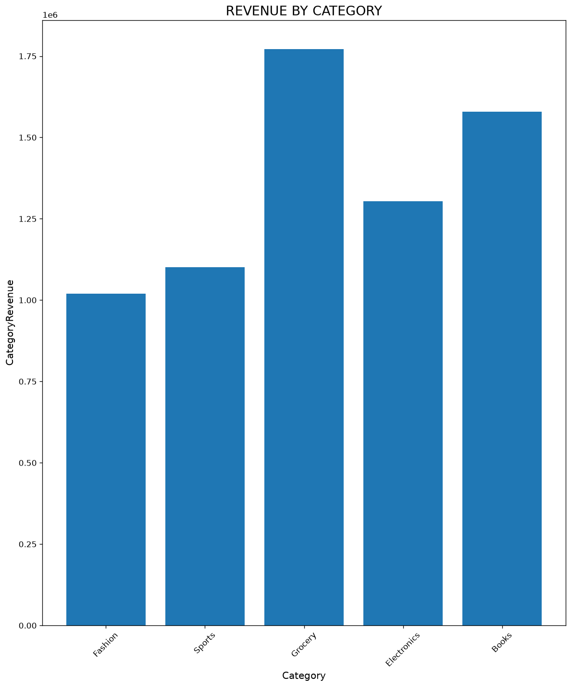
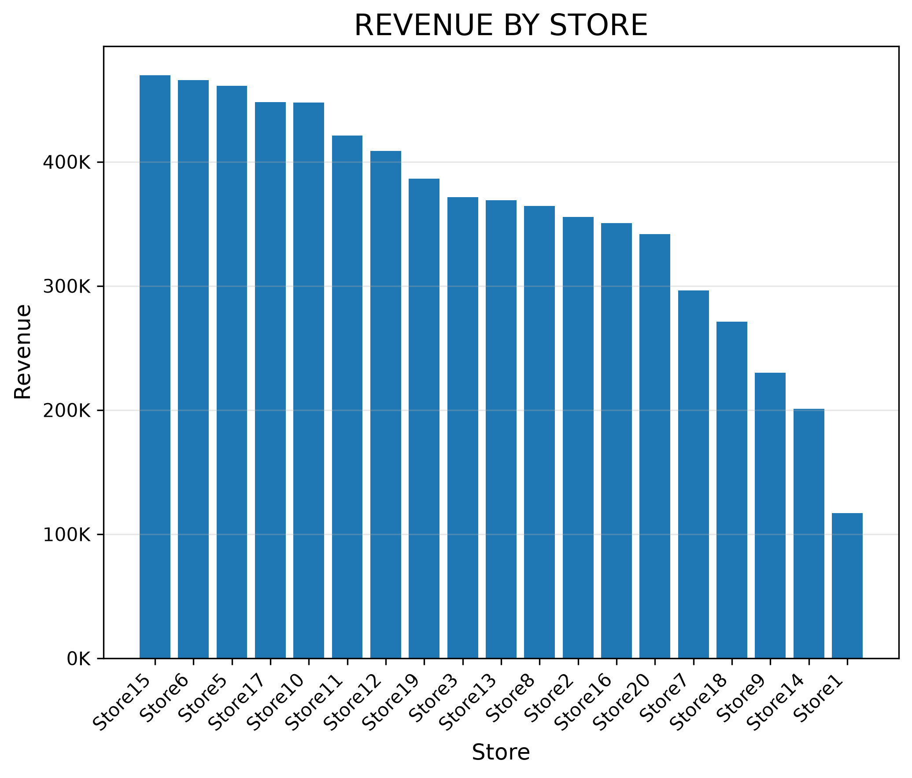
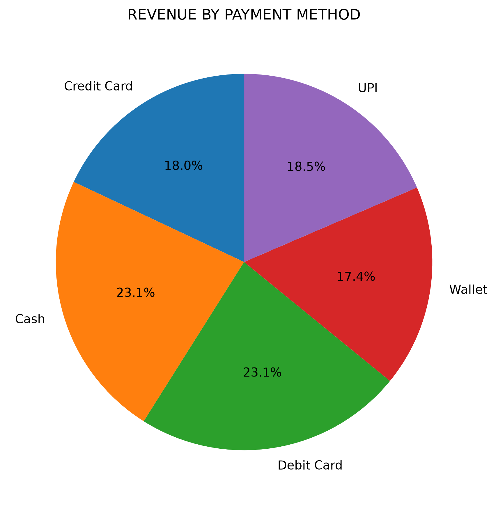
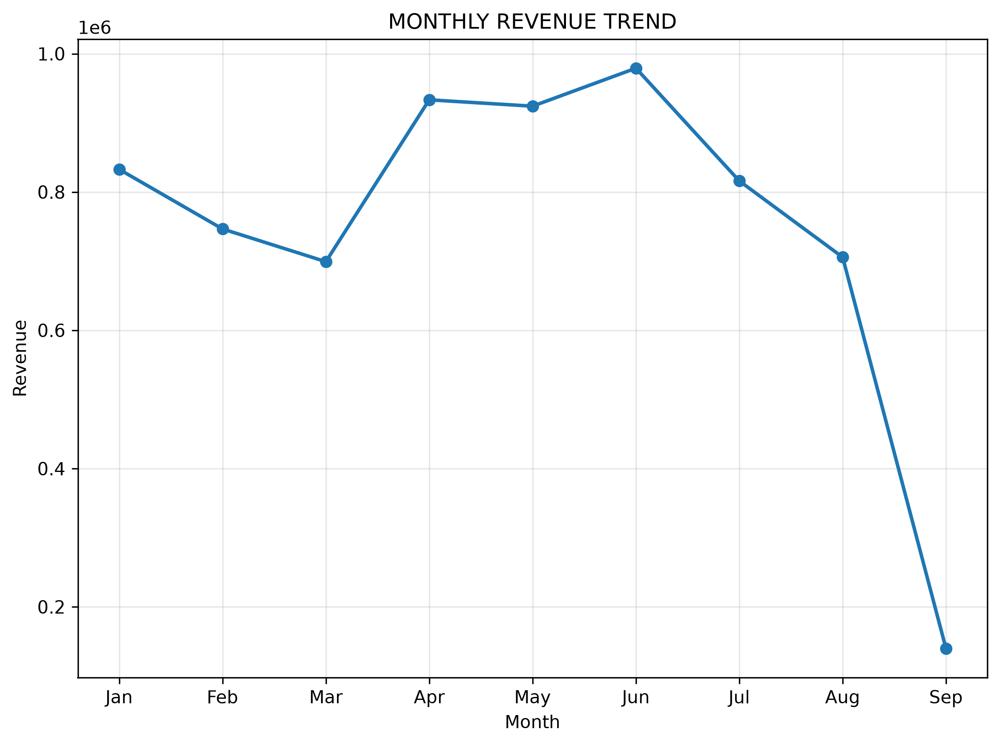
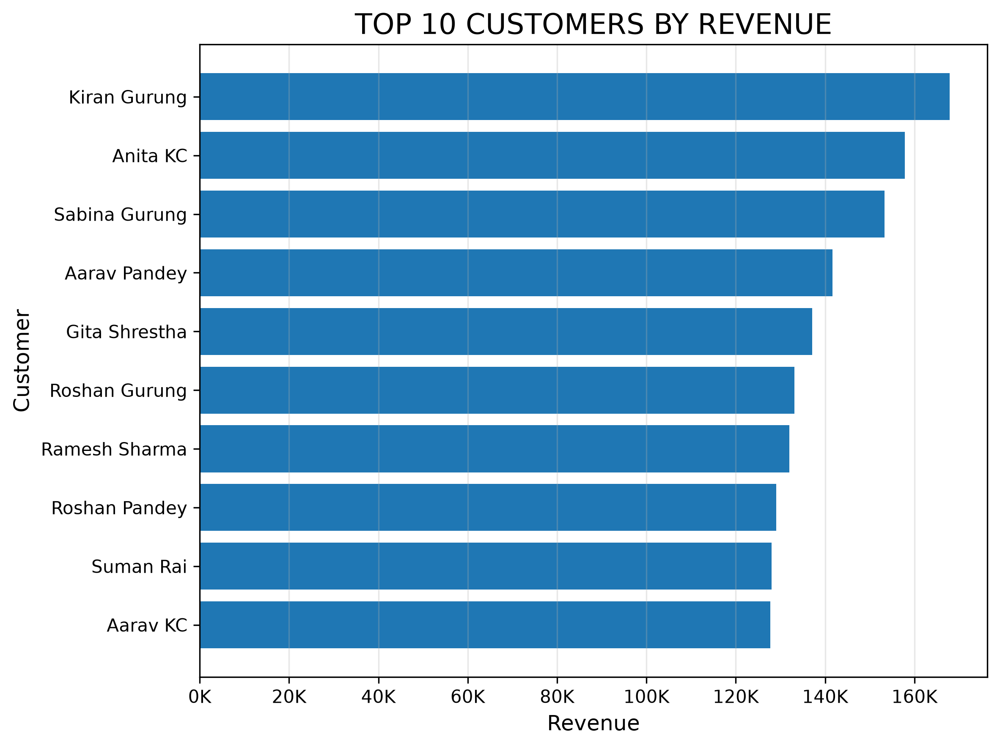
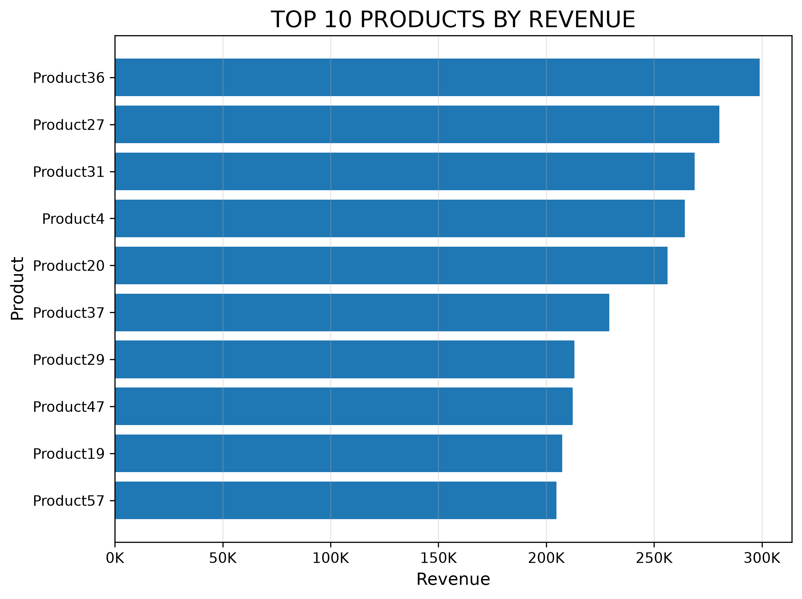
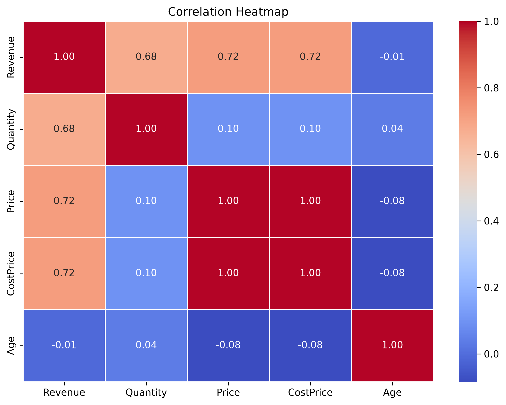
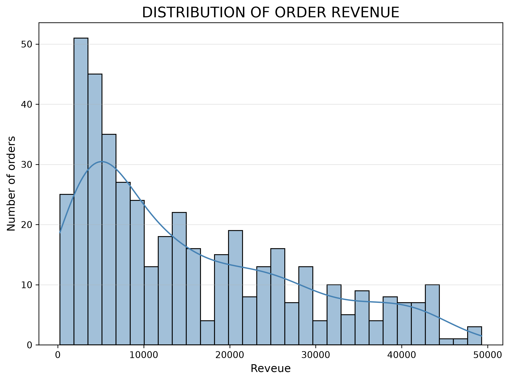
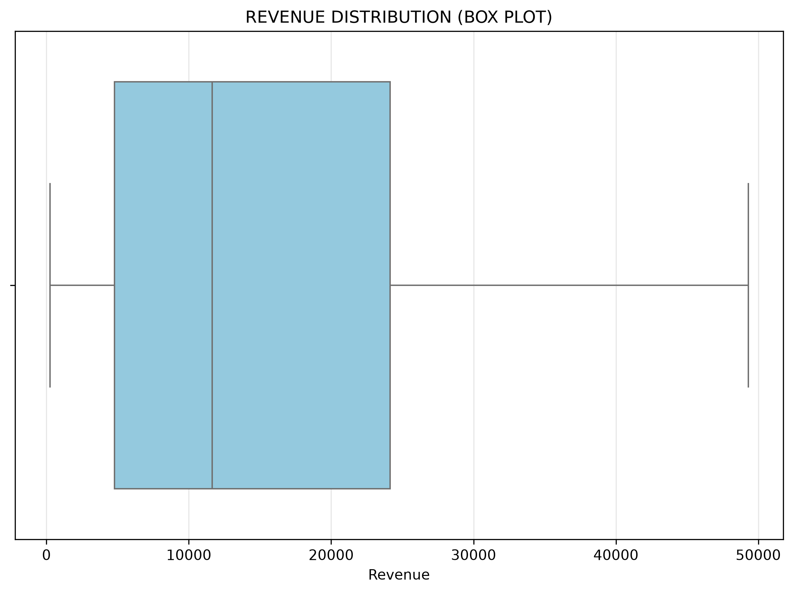
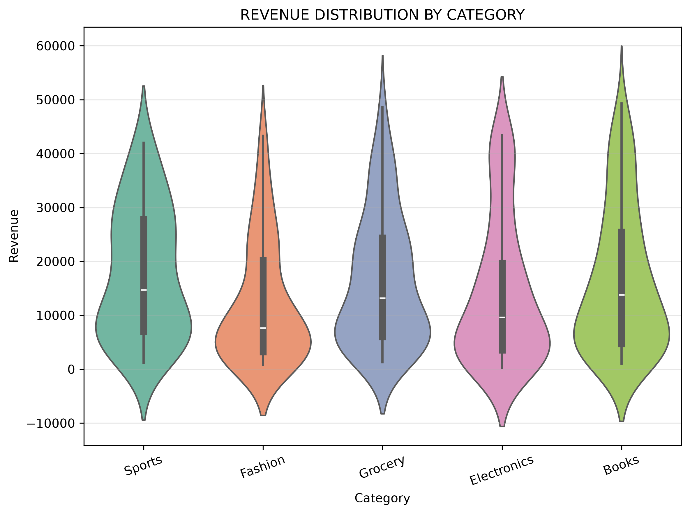

# Retail Sales ETL & Business Analytics using PySpark

An end-to-end **ETL (Extract, Transform, Load)** and **Business Analytics** project built with **PySpark**. The project processes retail sales data from multiple CSV files, performs data cleaning, validation, transformation, and business analytics, and visualizes key insights to support data-driven decision making.

---

## Features

- Extract data from multiple retail datasets
- Clean missing values and remove duplicate records
- Perform data validation and referential integrity checks
- Transform and integrate datasets into a unified master dataset
- Perform comprehensive business analytics using PySpark
- Visualize key business metrics using Matplotlib & Seaborn

---

## ETL Pipeline Architecture

                            Retail CSV Files
                                    │
                                    ▼
                            Extract Data
                                    │
                                    ▼
                            Data Cleaning & Validation
                                    │
                                    ▼
                            Data Transformation
                                    │
                                    ▼
                            Master Retail Dataset
                                    │
                                    ▼
                            Business Analytics
                                    │
                                    ▼
                            Matplotlib & Seaborn Visualizations


## Tech Stack

- Python
- PySpark
- Pandas
- Matplotlib
- Seaborn
- Jupyter Notebook (VS Code)

---

## 📂 Project Structure

```text
RetailSalesAnalytics/
│
├── .venv/                              # Virtual environment (not pushed to GitHub)
├── data/
│   ├── Customers.csv
│   ├── Inventory.csv
│   ├── Orders.csv
│   ├── Payments.csv
│   ├── Products.csv
│   └── Stores.csv
│
├── images/
│   ├── revenue_by_category.png
│   ├── revenue_by_payment_method.png
│   ├── monthly_revenue_trend.png
│   ├── Top_10_Customers_By_Revenue.png
│   ├── Revenue_By_Store.png
│   └── Top_10_Products_By_revenue.png
|
├── notebooks/
│   ├── RetailSalesETLAnalytics.ipynb
|
├── output/
│   └── RetailSalesETL/                 # Processed CSV output
│
├── README.md
└── .gitignore

```

---

## Business Analytics

The project performs comprehensive retail analytics covering sales ,customers, products, inventory,stores and advanced analytical scenarios using PySpark DataFrame APIs and Window functions.

### Sales Analysis
- Revenue by category, store, city, and payment method
- Monthly revenue trends
- Order and quantity analysis
- Category and store performance

### Customer Analytics
- Customer revenue analysis
- Top customers by revenue
- Average Order Value (AOV)
- Customer purchase behavior
- Favorite product categories
- Customer segmentation (Platinum, Gold, Silver, Bronze)
- Repeat customer analysis
- Purchase frequency analysis

### Product & Inventory Analytics
- Top-selling products by revenue and quantity
- Product performance summary
- Inventory turnover analysis
- Fast-moving and slow-moving products
- Stock availability analysis
- Stockout and restocking recommendations

### Store Analytics
- Store revenue and order performance
- Store ranking
- Average Order Value by store
- Payment analysis by store
- Category performance by store

### Advanced Analytics
- Window functions (Rank, Dense Rank, Row Number)
- Lag and Lead analysis
- Running cumulative revenue
- Rolling averages
- First and latest customer orders
- Revenue change analysis

---

## Visualizations

| Revenue by Category | Revenue by Store |
|:---------------------:|:----------------:|
|  |  |

| Revenue by Payment Method | Monthly Revenue Trend |
|:-------------------------:|:---------------------:|
|  |  |

| Top 10 Customers by Revenue | Top 10 Products by Revenue |
|:---------------------------:|:--------------------------:|
|  |  |

| Correlation Heatmap | Revenue Distribution (Histogram + KDE) |
|:-------------------:|:--------------------------------------:|
|  |  |

| Revenue Distribution (Box Plot) | Revenue Distribution by Category (Violin Plot) |
|:-------------------------------:|:----------------------------------------------:|
|  |  |

## How to Use

### 1. Clone the repository

```bash
git clone https://github.com/<your-username>/RetailSalesAnalytics.git
```

### 2. Navigate to the project folder

```bash
cd RetailSalesAnalytics
```

### 3. Create a virtual environment

```bash
python -m venv .venv
```

### 4. Activate the virtual environment

**Windows (PowerShell)**

```powershell
.\.venv\Scripts\Activate.ps1
```

**Windows (Command Prompt)**

```cmd
.\.venv\Scripts\activate.bat
```

### 5. Install dependencies

```bash
pip install -r requirements.txt
```

### 6. Open the notebook

Launch Jupyter Notebook or open the project in VS Code and run:

```
notebooks/RetailSalesETLAnalytics.ipynb
```

Run the notebook cells sequentially to:

- Extract data
- Transform and validate data
- Generate the master retail dataset
- Perform business analytics
- Create visualizations

---

## Learning Outcomes

Through this project, I gained practical experience in:

- Building end-to-end ETL pipelines with PySpark
- Data cleaning and preprocessing
- Data validation and integrity checks
- Multi-table joins and transformations
- Business analytics using Spark DataFrames
- Data visualization using Matplotlib
- Window functions and advanced aggregations
- Structuring a complete data engineering project

---

## Future Improvements

- Load processed data into PostgreSQL
- Automate the ETL pipeline using Apache Airflow
- Store data in Parquet format
- Build an interactive dashboard using Power BI or Tableau
- Process larger datasets using Spark Cluster

---
